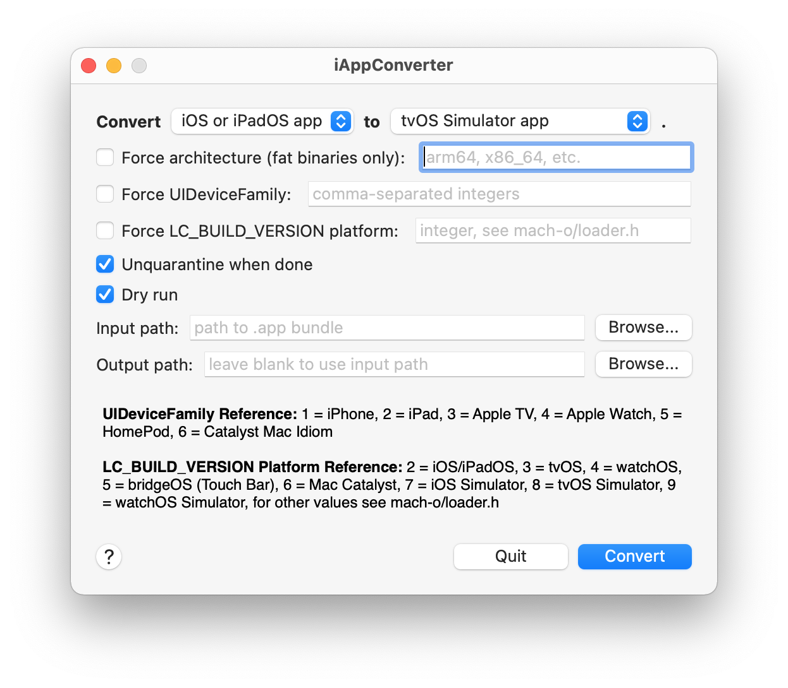
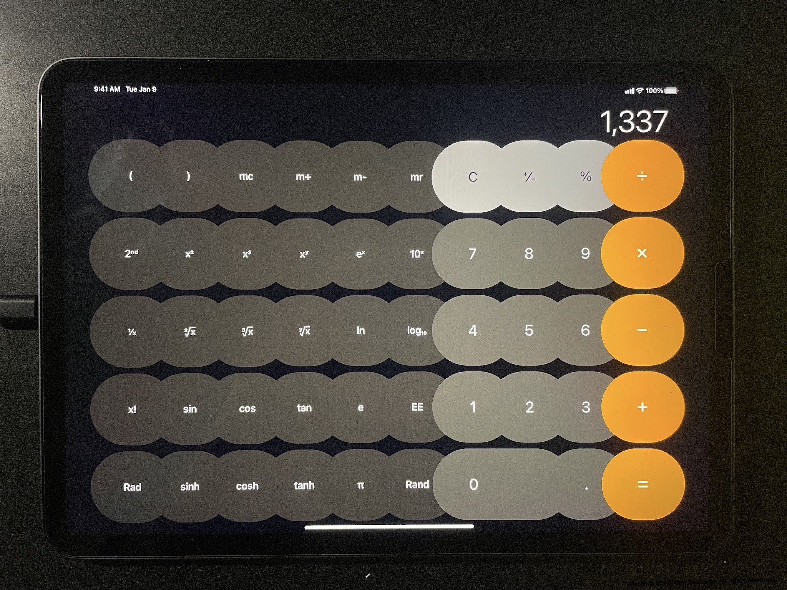

# iAppConverter

iAppConverter is a tool that allows you to convert apps to run on different Apple platforms than they were originally intended for.

Looking for a tool that lets you convert iOS apps to Mac Catalyst apps? iAppConverter doesn't support this yet. In the meantime, check out [my fork of @stroughtonsmith's marzipanify!](https://github.com/nitinseshadri/marzipanify-s)

## Demo

This is the iPhone calculator app running on an iPad. It has oversized buttons, but otherwise works well. With a couple tweaks, Apple could ship this on iPad.

This is [the same app](https://github.com/nitinseshadri/ViewControllerPresenter) running on the iOS, tvOS, and watchOS simulators, all converted from an unmodified iOS Simulator binary.
